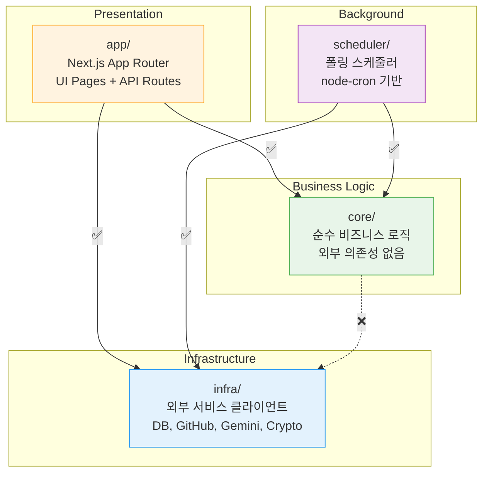
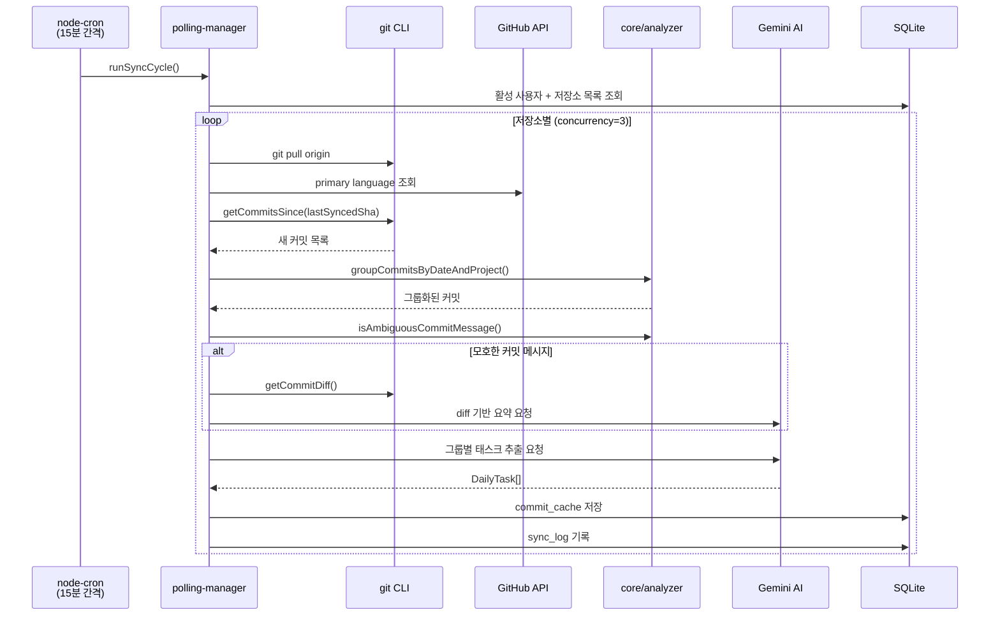
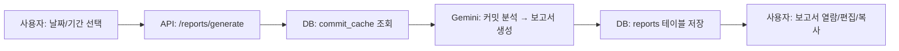
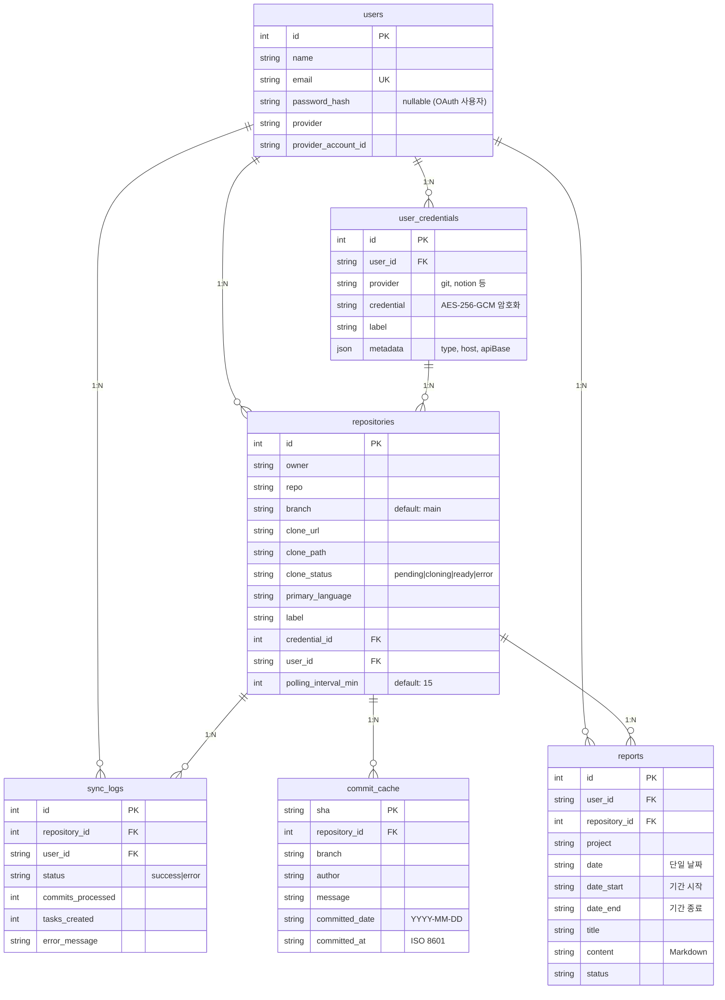

# 📋 Repo Reporter

> Git 커밋을 자동 수집하고 Gemini AI로 분석하여 프로젝트별 일일 업무 기록을 생성하는 Next.js 풀스택 서비스

---

## 📌 프로젝트 소개

**Repo Reporter**는 개발자가 매일 작성하는 Git 커밋을 자동으로 수집하고, Google Gemini AI가 분석하여 **업무 보고서를 자동 생성**하는 서비스입니다.

- 🔄 등록된 저장소에서 **15분마다** 새 커밋을 자동 수집
- 🤖 Gemini AI가 커밋을 분석하여 **업무 단위(Task)로 자동 분류**
- 📊 GitHub 스타일 **기여 히트맵**으로 작업량 시각화
- 📝 날짜/기간별 **업무 보고서 원클릭 생성**
- 🔐 다중 Git 호스팅 지원 (GitHub, GitLab, Gitea, Bitbucket)

---

## 🏗️ 아키텍처 개요

4계층 모놀리스 아키텍처로, 각 계층은 **단방향 의존**만 허용합니다.



### 계층 의존 규칙

| 출발 | → 도착 | 허용 |
|------|--------|------|
| `app/` | → `core/` | ✅ |
| `app/` | → `infra/` | ✅ |
| `scheduler/` | → `core/` | ✅ |
| `scheduler/` | → `infra/` | ✅ |
| `core/` | → `infra/` | ❌ |
| `core/` | → 외부 패키지 | ❌ |

> 💡 **`core/`는 순수 함수만 포함합니다.** 외부 IO, DB 접근, API 호출 등 일체의 부수효과가 없어야 합니다.

---

## 🛠️ 기술스택

| 카테고리 | 기술 | 버전 |
|----------|------|------|
| **Framework** | Next.js (App Router) | 16 |
| **Language** | TypeScript (strict mode) | 5 |
| **Runtime** | Node.js | 22 |
| **UI** | React | 19 |
| **Styling** | Tailwind CSS + shadcn/ui | 4 |
| **Database** | SQLite (better-sqlite3) | — |
| **Auth** | Auth.js (NextAuth v5) | 5.0-beta |
| **External API** | GitHub REST (@octokit/rest) | 22 |
| **AI** | Google Gemini (@google/genai) | — |
| **Scheduler** | node-cron | 4 |
| **Testing** | Vitest | 3 |
| **Date** | date-fns | 4 |

---

## 📁 디렉토리 구조

```
src/
├── app/                        # Next.js App Router
│   ├── (auth)/                 #   인증 그룹 (login, register)
│   ├── (dashboard)/            #   대시보드 그룹 (메인, repos, calendar, reports, settings)
│   └── api/                    #   REST API 엔드포인트
│
├── components/                 # React 컴포넌트
│   ├── ui/                     #   shadcn/ui 기본 컴포넌트 (CLI로 생성)
│   ├── layout/                 #   Sidebar, Header 등 레이아웃
│   └── data-display/           #   StatCard, ContributionHeatmap 등 데이터 표시
│
├── core/                       # 순수 비즈니스 로직 (외부 의존성 없음)
│   ├── analyzer/               #   커밋 그룹핑, 태스크 추출
│   │   ├── commit-grouper.ts   #     날짜/프로젝트별 커밋 그룹화
│   │   └── task-extractor.ts   #     모호한 메시지 감지, fallback 태스크 생성
│   ├── mapper/                 #   데이터 변환
│   └── types.ts                #   공유 타입 정의
│
├── infra/                      # 외부 서비스 클라이언트 (교체 가능한 어댑터)
│   ├── crypto/                 #   AES-256-GCM 토큰 암호화
│   ├── db/                     #   SQLite 스키마, 마이그레이션, CRUD
│   ├── gemini/                 #   Gemini API 래퍼
│   ├── github/                 #   Octokit 래퍼 (language 조회)
│   ├── git/                    #   git CLI 래퍼 (clone, pull, log)
│   └── git-provider/           #   플랫폼별 API (GitHub, GitLab, Gitea, Bitbucket)
│
├── scheduler/                  # 백그라운드 폴링 스케줄러
│   └── polling-manager.ts      #   node-cron → git fetch → Gemini 분석 → DB 저장
│
├── lib/                        # 유틸리티
│   └── auth.ts                 #   NextAuth 설정 (이메일 + HRMS OAuth2)
│
└── __tests__/                  # Vitest 테스트 (레이어 구조 미러링)
```

---

## 🔄 데이터 흐름

커밋 수집부터 보고서 생성까지의 전체 파이프라인입니다.



### 보고서 생성 흐름



---

## 🌐 API 라우트 맵

### 인증

| Method | Path | 설명 |
|--------|------|------|
| `POST` | `/api/register` | 회원가입 (bcrypt 해싱) |
| `*` | `/api/auth/[...nextauth]` | NextAuth 콜백 (이메일/HRMS OAuth2) |

### 자격증명

| Method | Path | 설명 |
|--------|------|------|
| `GET` | `/api/credentials` | 사용자의 자격증명 목록 |
| `POST` | `/api/credentials` | 새 자격증명 등록 (AES-256-GCM 암호화) |
| `GET/PUT/DELETE` | `/api/credentials/[id]` | 자격증명 상세/수정/삭제 |

### 저장소

| Method | Path | 설명 |
|--------|------|------|
| `GET` | `/api/repos` | 사용자의 저장소 목록 |
| `POST` | `/api/repos` | 저장소 등록 (백그라운드 bare clone) |
| `GET/PUT/DELETE` | `/api/repos/[id]` | 저장소 상세/수정/삭제 |
| `POST` | `/api/repos/[id]/sync` | 수동 동기화 트리거 |
| `GET` | `/api/repos/[id]/branches` | 브랜치 목록 |
| `GET` | `/api/repos/[id]/commits` | 커밋 목록 |

### 캘린더 / 히트맵

| Method | Path | 설명 |
|--------|------|------|
| `GET` | `/api/repos/commit-calendar` | 날짜별 커밋 집계 (히트맵 데이터) |
| `GET` | `/api/repos/commit-calendar/[date]` | 특정 날짜 커밋 상세 |
| `GET` | `/api/repos/commit-calendar/range` | 기간 범위 커밋 (기간 보고서용) |
| `GET` | `/api/commits/heatmap` | 6개월 히트맵 데이터 (OKLCH 색상) |

### 보고서

| Method | Path | 설명 |
|--------|------|------|
| `GET` | `/api/reports` | 보고서 목록 |
| `POST` | `/api/reports/generate` | AI 보고서 생성 (단일: 동기 / 기간: 비동기) |
| `GET/PUT/DELETE` | `/api/reports/[id]` | 보고서 상세/수정/삭제 |

### 기타

| Method | Path | 설명 |
|--------|------|------|
| `GET` | `/api/dashboard/stats` | 대시보드 통계 + 스케줄러 상태 |
| `GET` | `/api/git-providers/repos` | credential 기반 원격 저장소 목록 조회 |
| `POST` | `/api/sync` | 전체 수동 동기화 |
| `GET` | `/api/tasks` | 일일 태스크 목록 |

---

## 🗄️ DB 스키마

SQLite 기반으로 6개 테이블을 사용합니다.



---

## 🚀 개발 환경 설정

### 사전 요구사항

- **Node.js** 22+
- **Git** (저장소 clone/pull용)
- **npm** (패키지 관리)

### 설치 및 실행

```bash
# 1. 의존성 설치
npm install

# 2. 환경변수 설정
cp deploy/.env.example .env
# .env 파일을 편집하여 필요한 값 입력

# 3. 개발 서버 실행
npm run dev
```

### 환경변수

| 변수 | 설명 | 필수 |
|------|------|------|
| `GITHUB_TOKEN` | GitHub Personal Access Token | ✅ |
| `GEMINI_API_KEY` | Google Gemini API Key | ✅ |
| `AUTH_SECRET` | NextAuth.js 암호화 시크릿 | ✅ |
| `AUTH_URL` | NextAuth.js 베이스 URL | ✅ |
| `AUTH_HRMS_ID` | HRMS OAuth2 Client ID | 선택 |
| `AUTH_HRMS_SECRET` | HRMS OAuth2 Client Secret | 선택 |
| `AUTH_HRMS_ISSUER` | HRMS OIDC Issuer URL | 선택 |

> ⚠️ **HRMS 관련 변수는 사내 OAuth2 로그인을 사용하는 경우에만 필요합니다.**

### 주요 스크립트

```bash
npm run dev        # 개발 서버 (hot reload)
npm run build      # 프로덕션 빌드
npm start          # 프로덕션 서버
npm run lint       # ESLint 검사
npm test           # Vitest 단위 테스트
npm run test:watch # Vitest 감시 모드
```

---

## 🐳 배포

### Docker 배포

```bash
# 이미지 빌드
docker build -f deploy/Dockerfile -t repo-reporter .

# 컨테이너 실행
docker run -d \
  --name repo-reporter \
  -p 3002:3002 \
  --env-file .env \
  -v app-data:/app/data \
  repo-reporter
```

### Docker Compose

```bash
cd deploy
docker-compose up -d
```

### 배포 구조

```
deploy/
├── Dockerfile           # 3단계 빌드 (deps → builder → runner)
├── docker-compose.yml   # 서비스 정의 + 볼륨 매핑
├── .env.example         # 환경변수 템플릿
├── build.ps1            # PowerShell 빌드 스크립트
└── deploy.sh            # Bash 배포 스크립트
```

> 💡 **node-cron 스케줄러가 서버 프로세스 내에서 동작**하므로, 서버가 항상 실행 중이어야 자동 동기화가 작동합니다.

| 항목 | 설정 |
|------|------|
| 포트 | `3002` (기본값) |
| DB 파일 | `data/tracker.db` |
| 저장소 clone | `data/repos/` |
| 헬스체크 | `curl http://localhost:3002` (30초 간격) |
| 실행 유저 | `appuser` (UID 1001, 비루트) |

---

## 🧪 테스트

### 테스트 전략

| 계층 | 테스트 방식 |
|------|-------------|
| `core/` | 순수 단위 테스트 (mock 불필요) |
| `infra/` | 데이터 변환 함수만 단위 테스트 (API 호출 제외) |
| E2E | 저장소 등록 → 동기화 수동 테스트 |

### 테스트 실행

```bash
# 전체 테스트
npm test

# 감시 모드
npm run test:watch

# 특정 파일
npx vitest run src/__tests__/core/analyzer/commit-grouper.test.ts
```

### 테스트 파일 위치

```
src/__tests__/
├── core/
│   └── analyzer/
│       ├── commit-grouper.test.ts
│       └── task-extractor.test.ts
├── infra/
│   └── ...
└── scheduler/
    └── ...
```

---

## 📚 관련 문서

| 문서 | 설명 |
|------|------|
| [USER-GUIDE.md](USER-GUIDE.md) | 서비스 이용자를 위한 사용 가이드 |
| [AGENTS.md](AGENTS.md) | 에이전트 컨텍스트 맵 (아키텍처, 진입점, 규칙) |
| [CLAUDE.md](CLAUDE.md) | 에이전트 코딩 가이드 (스타일, 규칙) |
| [docs/superpowers/specs/](docs/superpowers/specs/) | 기능별 설계 스펙 문서 |
| [docs/superpowers/plans/](docs/superpowers/plans/) | 구현 계획 문서 |
